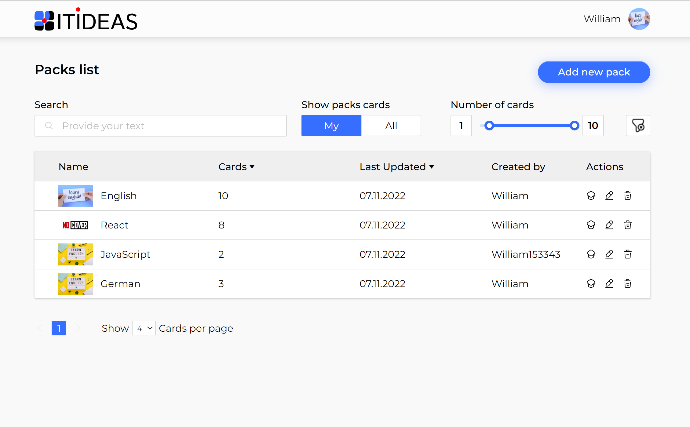

## Projects Title:

Cards

## About The Project:

This application is a learning cards application which allows users to create their own packs with cards or use others packs previously created by another users.

While creating a new pack of cards you will be providing the question and the answer on it for every card. After that you just need to start learning process and every time you answer the question evaluate it according to the grades inside how good do you know the answer. Application has a special randomizer that analyze your grades to the question and will show you more often those of the questions that you mentioned as most difficult.

DEMO: https://cards-alpha-jade.vercel.app/

## Built With:

- React
- Redux
- TypeScript
- Formik
- Yup
- Material UI
- Styled Components

## Usage:

To use the project you need to Sign Up firstly. After that just Sing In and go to main Packs List Page. There you will have a possibility to learn and create you personal packs.

## Development Team:

- DoWhatYouL0ve
- GorelovaP
- Nikylin96

## Contact:

DoWhatYouL0ve

- LinkedIn: https://www.linkedin.com/in/williamr0ss/
- GitHub: https://github.com/DoWhatYouL0ve
- Email: william_ross@mailfence.com

GorelovaP

- LinkedIn: https://www.linkedin.com/in/polin%D0%B0-gorelova/
- GitHub: https://github.com/GorelovaP
- Email: gorelic2000p@gmail.com

## License:

MIT License

Copyright (c) [year] [fullname]

Permission is hereby granted, free of charge, to any person obtaining a copy
of this software and associated documentation files (the "Software"), to deal
in the Software without restriction, including without limitation the rights
to use, copy, modify, merge, publish, distribute, sublicense, and/or sell
copies of the Software, and to permit persons to whom the Software is
furnished to do so, subject to the following conditions:

The above copyright notice and this permission notice shall be included in all
copies or substantial portions of the Software.

THE SOFTWARE IS PROVIDED "AS IS", WITHOUT WARRANTY OF ANY KIND, EXPRESS OR
IMPLIED, INCLUDING BUT NOT LIMITED TO THE WARRANTIES OF MERCHANTABILITY,
FITNESS FOR A PARTICULAR PURPOSE AND NONINFRINGEMENT. IN NO EVENT SHALL THE
AUTHORS OR COPYRIGHT HOLDERS BE LIABLE FOR ANY CLAIM, DAMAGES OR OTHER
LIABILITY, WHETHER IN AN ACTION OF CONTRACT, TORT OR OTHERWISE, ARISING FROM,
OUT OF OR IN CONNECTION WITH THE SOFTWARE OR THE USE OR OTHER DEALINGS IN THE
SOFTWARE.

